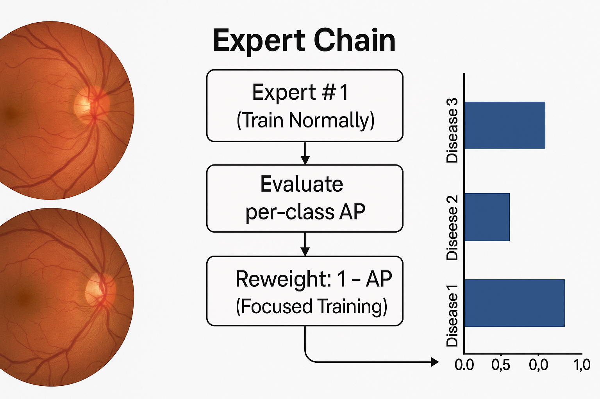

# 🧐 Retinal Disease Classification with Sequential Expert Training

**Multi-label classification of retinal diseases using a boosting-inspired ensemble of expert models.**

This repository presents a novel training pipeline for classifying retinal diseases from fundus images. Inspired by boosting, it iteratively trains a sequence of expert models—each one learning to improve upon the weaknesses of its predecessor. The result is a highly accurate and robust ensemble system for real-world diagnosis tasks.

---

## ✨ Highlights

- **📚 Boosting-Inspired Expert Chain**  
  Each expert focuses on what the previous model got wrong—enabling iterative refinement.

- **⚖️ Dynamic Class Weighting**  
  Automatically recalibrates the loss function to target difficult or rare disease classes.

- **🧠 Model Agnostic**  
  Plug-and-play support for powerful pre-trained architectures:
  - Vision Transformers: ViT, CLIP-ViT, DINO-ViT  
  - ResNeXt  
  - EfficientNet

- **🧪 Reproducibility First**  
  Built with PyTorch Lightning to enforce modularity and clarity.

- **📊 Integrated Experiment Tracking**  
  Every training run is logged in real-time using Weights & Biases.

---

## 🔁 How It Works: Sequential Expert Training


Each expert is trained to focus on what the previous one missed by dynamically adjusting class weights:

> **Weight Formula**: `class_weight = 1 - average_precision_score`

---

## 📆 Project Structure

```bash
.
├── train.py               # Main training script
├── nets.py                # Modular model definitions
├── data.py                # Dataset loaders (extendable)
├── utils/                 # Helper functions, weights, metrics
├── models/                # Saved checkpoints
└── README.md
```

---

## 💪 Installation

```bash
git clone https://github.com/es15326/Multi-Disease-Detection.git
cd Multi-Disease-Detection
python -m venv venv
source venv/bin/activate  # Windows: venv\Scripts\activate
pip install -r requirements.txt
```

<details>
<summary><code>requirements.txt</code></summary>

```
torch
torchvision
pytorch-lightning
pandas
numpy
scikit-learn
scikit-image
opencv-python-headless
wandb
transformers
Pillow
```

</details>

---

## 📁 Dataset Format

Organize your data like this:

```
dataset/
├── train/
│   ├── image_001.jpg
│   └── ...
├── val/
│   └── image_050.jpg
├── train_labels.csv
└── val_labels.csv
```

The CSV files should contain one-hot encoded labels:

```csv
image_id,no_finding,disease_1,disease_2,disease_3,...
image_001,0,1,0,1,...
image_002,1,0,0,0,...
```

---

## 🚀 Training

```bash
python train.py \
  --train_img_path ./dataset/train \
  --val_img_path ./dataset/val \
  --train_csv ./dataset/train_labels.csv \
  --val_csv ./dataset/val_labels.csv \
  --arch vit-b \
  --resolution 512 \
  --batch_size 16 \
  --max_epochs 100 \
  --boosting_experts 10 \
  --devices 0 1 \
  --savedir ./models \
  --tag vit-b-run-1
```

### 🔧 Notable Flags

| Flag | Description |
|------|-------------|
| `--arch` | Model architecture (e.g., `vit-b`, `resnext`, `efficientnet`) |
| `--boosting_experts` | Number of sequential experts |
| `--freeze-backbone` | Optional: Only train classifier head |
| `--savedir` | Checkpoint and weight output directory |

---

## 📈 Monitoring & Results

- **🔍 Weights & Biases**:  
  All experiments are logged automatically—including metrics, validation curves, and class-wise performance.

- **📂 Checkpoints**:  
  The best-performing expert checkpoint (by `val_s_score`) is saved to disk. Intermediate class weights are also preserved.

---

## 🧠 Supported Architectures

| Model Flag | Description |
|------------|-------------|
| `resnext` | ResNeXt-50 32x4d |
| `efficientnet` | EfficientNet-B4 |
| `vit-b` | Vision Transformer Base |
| `clip-l` | CLIP-pretrained ViT-Large |
| `vits16`, `vits8` | DINO ViT-Small (patch sizes 16/8) |
| `vitb16`, `vitb8` | DINO ViT-Base (patch sizes 16/8) |

🧰 Add your own by extending `nets.py` with the `@register_model` decorator.

---

## 💡 Citation

```bibtex
@misc{retinalboost2025,
  title={Retinal Disease Classification with Sequential Expert Training},
  author={Elham Soltani Kazemi},
  year={2025},
  url={https://github.com/es15326/Multi-Disease-Detection.git}
}
```

---

## 🤝 Contact

Have questions, ideas, or feedback?  
📬 Reach out: [email@example.com](mailto:email@example.com)

---

## 🏆 Performance

Evaluated on the [RFMiD](https://www.kaggle.com/datasets/rishitdagli/retinal-fundus-image-for-multi-disease-detection) dataset with 45 disease labels:

| Model             | F1 (Macro) | AUC (Macro) | Notes                      |
|------------------|------------|-------------|----------------------------|
| ViT (Single)     | 0.765      | 0.872       | No boosting or reweighting |
| Expert Chain (Ours) | **0.826**  | **0.912**    | 10 experts, ViT-Base        |

---

## 📊 Dataset

This project uses the publicly available **[RFMiD dataset](https://www.kaggle.com/datasets/rishitdagli/retinal-fundus-image-for-multi-disease-detection)** for training and evaluation. It contains:

- 3200 high-resolution retinal fundus images
- 45 disease labels (multi-label format)
- Imbalanced distribution across rare and common diseases

The boosting strategy helps adaptively improve under-represented diseases.

---

<p align="center">
  
</p>
